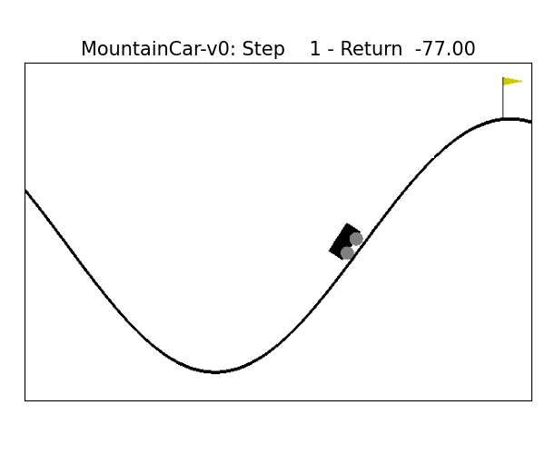
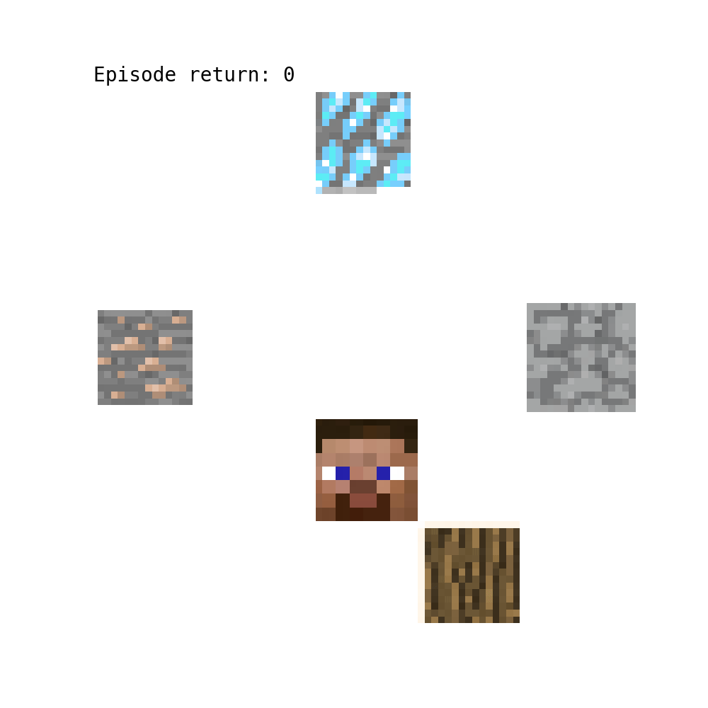

# Curious Agents

This repository is dedicated to the exploration and training of Reinforcement Learning (RL) agents using unsupervised and self-supervised learning. The overarching objective is to investigate whether an agent can first comprehend and navigate an environment devoid of explicit rewards and then subsequently be fine-tuned with a reward signal. The primary aims are:

1. To determine the efficacy of this approach in expansive open-world scenarios.
2. To evaluate if this approach scales more effectively than training from scratch.


## Environments
Below one can see some of the trained agents solving various environments without every receiving rewards from the environment.

|  |  |  |
|:----------------------------------------------:|:--------------------------------------:|:----------------------------------------------:|
|                 Mountain Car                   |                 Maze                    |                 Minecraft2D                    |


## Background

The foundation for this code is inspired by the information shared in these [blogposts](https://medium.com/@dries.epos/curious-agents-ebfee02ef024). 

The base algorithm has been adapted from [purejaxrl](https://github.com/luchris429/purejaxrl). We highly recommend checking out their GitHub repository for more details.

## Build Instructions

To set up and run the example locally:

1. **Build the Virtual Environment**:

    Use the command below to construct the virtual environment:

    ```
    make build
    ```

2. **Configure the `main.yaml` File**:

    Ensure to update `main.yaml` to run the various examples as follows:
    
    **Curious agents II: MountainCar**
    ```
    defaults:
      - agent: ppo_ff_world_model
    env_name: MountainCar-v0
    training_steps: 1e7
    ```
    **Curious Agents III: BYOL-Explore**
    ```
    defaults:
      - agent: ppo_byol_explore
    env_name: Maze-v0
    training_steps: 8.8e6
    ```
    **Curious Agents IV: BYOL-Hindsight**
    ```
    defaults:
      - agent: ppo_byol_hindsight
    env_name: Minecraft2D
    training_steps: 1e9
    ```

3. **Run the Example**:

    After building, you can execute the example with:

    ```
    make
    ```

